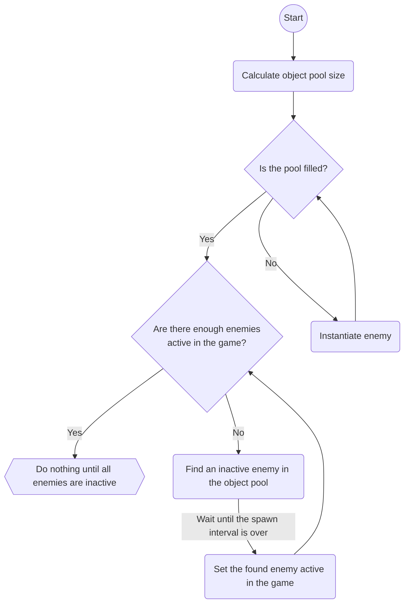

# Tower Evolution

## About

### In this tower defense game you need to place towers in order to prevent the enemies from reaching the end. You can buy and upgrade different kinds of towers in the shop with coins you earn when you kill an enemy.
### The enemies become stronger and will come in more amounts every wave. So you need to play smart and think before you buy or upgrade a tower.

## Mechanics

### There are a few mechanics in this game. The biggest one being the [spawn system of the enemies](#flowchart). It uses an object pool to reduce lag and calculates exactly how many enemies the object pool needs so all of them are used.
### Another mechanic is the automatic path generation. New game maps can be easily made by only changing the position and amount of corners.
### There are also some minor mechanics, such as the camera transition from 3D to 2D perspective when opening the in-game shop.

## What I learned

### The making of this game taught me a lot of new things in C#. The first thing being object pools, which are a lot more efficient than what I did before I used them.
### I also learned how to make my code look cleaner and easier to read. This allowed me to work faster. And the [planning in Trello](https://trello.com/b/txKUaVVr/tower-defense-tower-evolution) helped with that too.

---

## Flowchart

### This flowchart explains how the enemy spawn system spawns new enemies in the game:

---

#### Mitchel Klijn