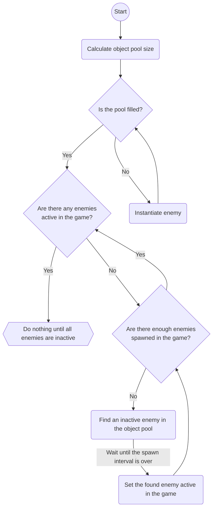

# Tower Evolution

### In deze tower defense game moet je torens kopen en upgraden om te voorkomen dat de vijanden het einde bereiken.
### Je start met oude torens, maar naarmate je ze upgradet worden ze steeds moderner en sterker.
### Maar de vijanden worden dat ook, dus speel tactisch en probeer het zo lang mogelijk uit te houden.

---

### [Trello](https://trello.com/b/txKUaVVr/tower-defense-tower-evolution)

---

### Een flowchart van het spawnsysteem van de vijanden:

---

##### Mitchel Klijn